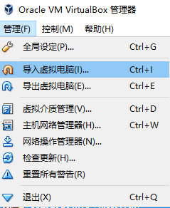
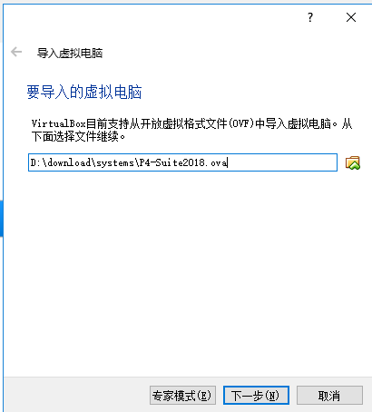
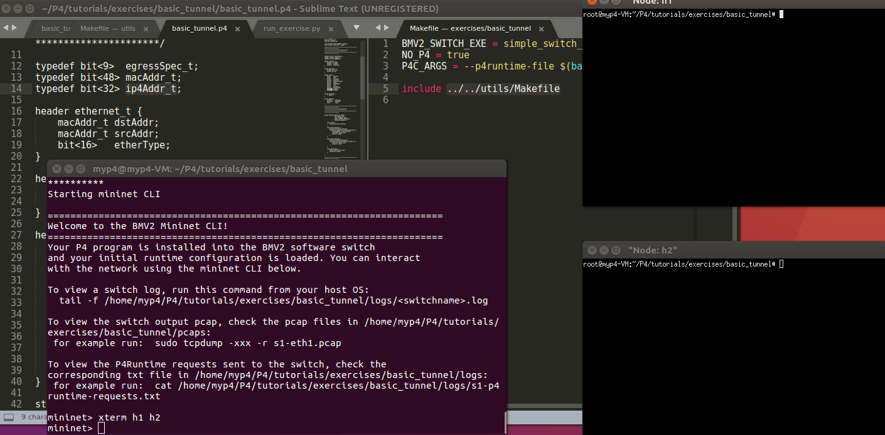
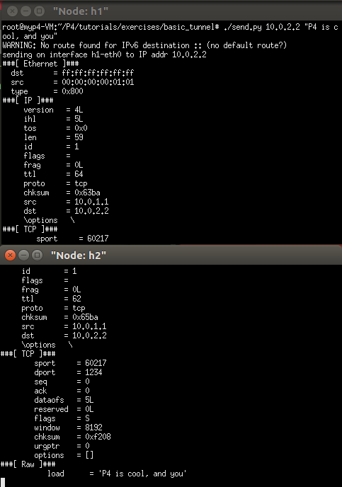
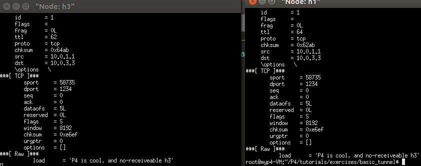
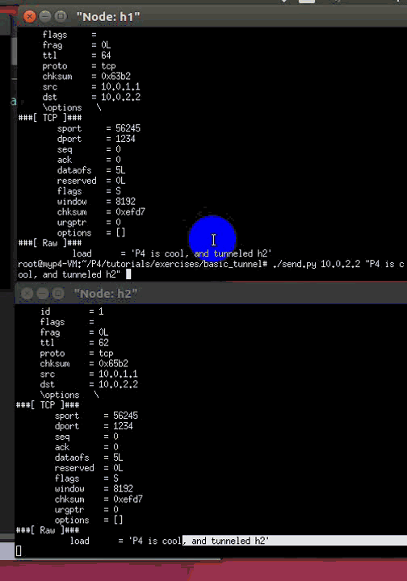

# P4 Tutorial

可以直接跳到下方中文部分

## Introduction

Welcome to the P4 Tutorial! We've prepared a set of exercises to help
you get started with P4 programming, organized into several modules:

1. Introduction and Language Basics
* [Basic Forwarding](./exercises/basic)
* [Basic Tunneling](./exercises/basic_tunnel)

2. P4Runtime and the Control Plane
* [P4Runtime](./exercises/p4runtime)

3. Monitoring and Debugging
* [Explicit Congestion Notification](./exercises/ecn)
* [Multi-Hop Route Inspection](./exercises/mri)

4. Advanced Behavior
* [Source Routing](./exercises/source_routing)
* [Calculator](./exercises/calc)
* [Load Balancing](./exercises/load_balance)

## Presentation 

The slides are available [online](http://bit.ly/p4d2-2018-spring) and
in the P4_tutorial.pdf in the tutorial directory.

A P4 Cheat Sheet is also available [online](https://drive.google.com/file/d/1Z8woKyElFAOP6bMd8tRa_Q4SA1cd_Uva/view?usp=sharing)
which contains various examples that you can refer to.
        
## Obtaining required software

If you are starting this tutorial at the Spring 2018 P4 Developer Day,
then we've already provided you with a virtual machine that has all of
the required software installed.

Otherwise, to complete the exercises, you will need to either build a
virtual machine or install several dependencies.

To build the virtual machine:
- Install [Vagrant](https://vagrantup.com) and [VirtualBox](https://virtualbox.org)
- `cd vm`
- `vagrant up`
- Log in with username `p4` and password `p4` and issue the command `sudo shutdown -r now`
- When the machine reboots, you should have a graphical desktop machine with the required
software pre-installed.

To install dependencies by hand, please reference the [vm](../vm) installation scripts.
They contain the dependencies, versions, and installation procedure.
You can run them directly on an Ubuntu 16.04 machine:
- `sudo ./root-bootstrap.sh`
- `sudo ./user-bootstrap.sh`

# 中文部分by tt

p4_steps.md

[TOC]

# install 

建议直接使用ova

## 使用微云里的ova 虚拟机导入vbox，直接可用

link： https://share.weiyun.com/5q791LD

# 一些实例

参考： https://github.com/p4lang/tutorials

## 内容有：

1. Introduction and Language Basics
- Basic Forwarding
- Basic Tunneling
2. P4Runtime and the Control Plane
- P4Runtime
3. Monitoring and Debugging
- Explicit Congestion Notification
- Multi-Hop Route Inspection
4. Advanced Behavior
- Source Routing
- Calculator
- Load Balancing

# 实践

## 实践basic tunneling

ps： 所有步骤可以参考 tutorial ：

https://github.com/p4lang/tutorials/tree/master/exercises/basic_tunnel

- In h2's xterm, start the server:`bash ./receive.py`
- 然后，首先测试 without tunneling: 在h1 使用：`./send.py 10.0.2.2 "P4 is cool, and you" `

没有启动h3的receive 的时候，h1 可以发送，当然没错，开启了h3的xterm 终端，并开启receive.py，如下：

## 接下来测试带有我们自己tunnel tag 的报文

- h1 send  h2 ：  `./send.py 10.0.2.2 "P4 is cool" --dst_id 2`

- h1 send to h2 by send to h3 :  `./send.py 10.0.3.3 "P4 is cool" --dst_id 2`

